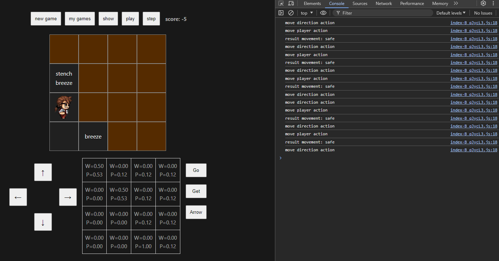
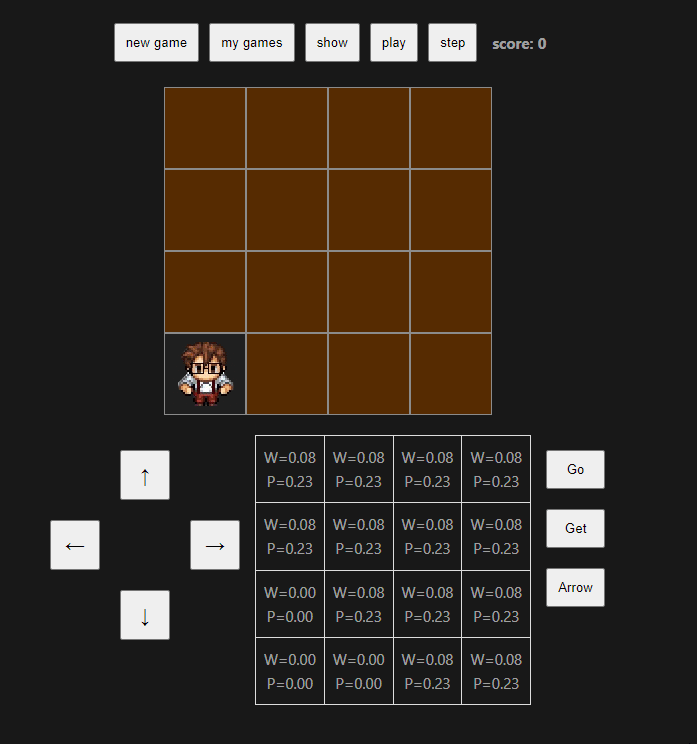

# Wumpus World

🌍 *[Português](README.md) ∙ [**English**](README_en.md)*

Wumpus World is a classic game that presents a logical problem in artificial intelligence. The player navigates through a grid world, trying to avoid dangers such as pits and the terrible Wumpus while searching for a gold treasure. This repository presents an implementation in Vue with TypeScript, using Vite. The web version is available to play [here](https://juniocesarferreira.github.io/WumpusWorldGameVue/).

It is worth noting that the original implementation of this project was done in C# and is available in the repository [WumpusWorldGame](https://github.com/JunioCesarFerreira/WumpusWorldGame).

## The Wumpus World Game

### Introduction

Wumpus World is a simulated board game that serves as a standard test environment for reasoning and learning algorithms in AI. The game was introduced by Gregory Yob in 1973 and has since become a classic example used to teach AI concepts, especially in propositional logic and reasoning under uncertainty.

### Game Objective

The player controls an agent (the explorer) whose goal is to find a hidden treasure in a cavernous world and exit alive. The world is composed of a grid of rooms connected by passages. The player must avoid or neutralize dangers such as pits and the feared Wumpus, a creature that inhabits one of the rooms.

### Game Rules

1. **Grid Environment**: The world is a 4x4 square grid where each square can contain a pit, the Wumpus, gold, or nothing. The rooms (cells of the 4x4 matrix) are connected vertically and horizontally. The agent starts at position [1,1], which is the entrance and exit of the cave.

2. **Perceptions**:
   - **Breeze**: Felt in squares adjacent to pits.
   - **Stench**: Felt in squares adjacent to the Wumpus.
   - **Glitter**: The gold is in the same square.
   - **Bump**: The agent tried to move through a wall.
   - **Scream**: The Wumpus has been killed.

3. **Agent Actions**:
   - **Move** forward.
   - **Turn left** or **right**.
   - **Shoot** an arrow in the direction it is facing (the agent has only one arrow).
   - **Grab** the gold.
   - **Exit** the world once the gold has been collected.

4. **Termination Conditions**:
   - The agent grabs the gold and exits the cave.
   - The agent falls into a pit or is eaten by the Wumpus.
   - The agent decides to leave the cave without the gold.

5. **Performance Measure**:
   - **+1000** for grabbing the gold.
   - **-1000** if the agent falls into a pit or is eaten by the Wumpus.
   - **-1** for each action taken.
   - **-10** for using the arrow.

---

## Requirements

- Node.js
- Web Browser

## Installation

1. Clone the repository to your local machine using `git clone`.
2. Navigate to the project directory.
3. Install dependencies with `npm install`.
4. Start the development server with `npm run dev`.

---

## Usage

### Manual Play
- Use the direction buttons to move the player through the grid.
- The "Go" button executes the move in the currently selected direction.
- Use the "Get" button to grab the gold if you are in the same cell.
- Use the "Arrow" button to shoot an arrow in the currently selected direction.
- Press the corresponding keys for faster interaction:
  - `Arrow keys` to move.
  - `Enter` for "Go".
  - `Space` for "Get".
  - `A` for "Arrow".
- Sensory hints like "Breeze" and "Stench" indicate the proximity of dangers.
- A table with probability distributions of pits and Wumpus in each cell.

### Automatic Play

One of the reasons for developing this project was the desire to implement an intelligent agent for this classic AI problem. At the top of the graphical interface, you will find buttons that allow you to select some favorite games and run the intelligent agent that controls the character to achieve the best result for the proposed game. The buttons at the top of the graphical interface are:

- `new game`: Generates a new random game.
- `my games`: Alternates between a small collection of my favorite games.
- `show/hide`: Allows you to display the game's dangers and hide them (during the game, the dangers are hidden).
- `play/stop`: Starts or stops the automatic mode.
- `step`: Executes the automatic mode step by step.

### Enable the Browser Console to Track

---

## About the Probability Distributions

#### Definition of Adjacency of a Set
Let $C$ be a subset of cells of the board $B$. The adjacency set $A = \text{adj}(C)$ is given by all cells adjacent to the cells of $C$ in the directions above, below, right, and left.

$$
A = \text{adj}(C) = \bigcup_{(i,j)\in C}\big\lbrace (i+1,j), (i-1,j), (i,j+1), (i,j-1)\big\rbrace
$$
  
#### Example
Let $C = \lbrace c_{1,1} \rbrace$, then $\text{adj}(C) = \lbrace c_{1,2}, c_{2,1} \rbrace$.

#### Definition of Subsets
We define:
- $V$ as the set of cells visited by the player.
- $S$ as the set of cells considered safe by deduction.
- $S^c := B \setminus S$.
- $M$ as the set of cells that indicate some danger in the adjacency.
- $H := \big\lbrace H_{i,j} \in 2^B \mid H_{i,j} = \text{adj}(m_{i,j}) \cap S^c, \forall m_{i,j} \in M \big\rbrace$.

Note that $M \subset V \subset S$.

#### Definition
We denote by $\mathcal{C}^S_n$ the set of all possible combinations of $n$ cells of $S^c$ that may contain $n$ dangers (whether pits or the Wumpus). That is,

$$
\mathcal{C}^S_n := \big\lbrace C \subset S^c \mid ||C|| = n \big\rbrace.
$$
  

Let $M$ be the set of cells already visited with an indication of danger. We define the set of valid configurations by:

$$
V(\mathcal{C}^S_n) := \big\lbrace \mathbf{C} \in \mathcal{C}^S_n \mid \text{adj}(\mathbf{C})^c \cap M = \emptyset \big\rbrace. 
$$
  

Thus, each configuration $\mathbf{C} \in V(\mathcal{C}^S_n)$ represents a possible distribution of the indicated dangers.

#### Danger Probability

$$
P(C_{i,j} = p \mid M, S) = \begin{cases}
0, & \text{se } C_{i,j} \in S,\\
\frac{||\lbrace \mathbf{C} \in V(\mathcal{C}^S_n) \mid C_{i,j} \in \mathbf{C} \rbrace||}{||V(\mathcal{C}^S_n)||}, & \text{se } C_{i,j} \notin S.
\end{cases}
$$

This distribution is implemented in the class [`HazardProbabilityDistribution`](./WumpusWorldGame/src/classes/HazardProbabilityDistribution.ts).

---

## About the Intelligent Agent

The intelligent agent implemented to solve the Wumpus World problem follows an algorithm based on probabilities and rules to explore the environment, avoid dangers, and achieve the goal of collecting the treasure (gold) and returning to the starting position. The algorithm consists of the following main steps:

#### 1. Initialization
- **Constructors**: The agent receives the objects `Game`, `GameHandler`, and `HazardProbabilityDistribution` for Wumpus and pits.
- **Attributes**: The agent maintains information about the player's position, the board, probability distributions of dangers, visited cells, Wumpus hunting state, and possible Wumpus positions.

#### 2. Step Execution (`step`)
At each step, the agent executes the decision-making logic:

- **Mark as Visited**: Marks the current position of the player as visited.
- **Update Probability Distributions**: Updates the probability distributions for the Wumpus and pits.
- **Check Treasure**: If the player is at the gold position and has not grabbed it, the agent collects the gold and calculates the path back to the exit.
- **Return to Exit**: If the player has already grabbed the gold, the agent follows the calculated path to return to the starting position.
- **Exploration and Wumpus Hunt**:
  - **Explore Safe Cells**: The agent looks for safe and unexplored adjacent cells to move to.
  - **Wumpus Hunt**: If there are no safe cells available and the Wumpus is still alive, the agent enters Wumpus hunting mode, trying to locate and eliminate the Wumpus.

#### 3. Wumpus Hunting Mode
The Wumpus hunting algorithm uses a state machine to manage the different stages of the hunt:

- **None State**: Searches for the Wumpus position with a probability of 1.0. If found, prepares the path to an adjacent position.
- **Hunting State**: Follows the prepared path to the position adjacent to the Wumpus.
- **Shooting State**: Shoots the arrow in the direction of the Wumpus. If the Wumpus is in an uncertain position, chooses randomly between two possible positions.
- **Finished State**: Updates the safety distribution after the shot and ends the hunt.

#### 4. Auxiliary Methods
- **Move Towards Target (`redirect`)**: Sends movement commands to move the player towards the specified target.
- **Update Probability Distributions**: Calculates updated probabilities for the presence of the Wumpus and pits based on the current board information.
- **Find Wumpus Position (`searchesWumpus`)**: Searches for cells on the board with a probability of 1.0 for the Wumpus.
- **Find Possible Wumpus Positions (`tryFindPossibleWumpusPositions`)**: Identifies cells with a probability of 0.5 for the Wumpus.
- **Prepare Path for Hunt (`preparePathToHunt`)**: Calculates the shortest path to one of the safe cells adjacent to the Wumpus.
- **Find Safe and Unexplored Cell (`findUnexploredSafeCell`)**: Identifies safe and unexplored adjacent or nearby cells to explore.
- **Get Adjacent Cells (`getAdjacentCells`)**: Returns a list of cells adjacent to a specified position.

### Final Considerations
The intelligent agent combines rule-based and probabilistic exploration with a Wumpus hunting strategy to maximize its chances of success while minimizing the risk of death. The modular structure of the code allows for the extension and refinement of the agent's functionalities.

#### [Online test.](https://juniocesarferreira.github.io/WumpusWorldGameVue/)

---

## Future Improvements and Experimentations

- Allow the use of other strategies in automatic mode.

- Improve the game's visuals and responsiveness.

---

## License

This project is licensed under the [MIT License](LICENSE).

---

## Contribution

Contributions are welcome! To contribute:

1. Fork the project.
2. Create a new branch for your modifications (`git checkout -b feature/AmazingFeature`).
3. Commit your changes (`git commit -m 'Add some AmazingFeature'`).
4. Push to the branch (`git push origin feature/AmazingFeature`).
5. Open a Pull Request.

---
